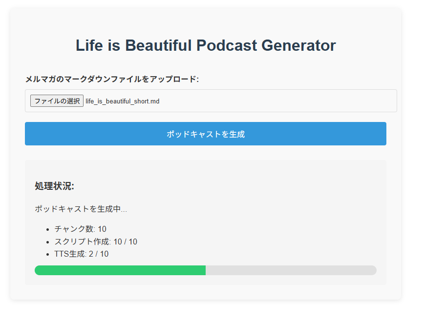

# Life is Beautiful Podcast Generator

「Life is Beautiful」メルマガからポッドキャストを自動生成するアプリケーションです。



## 機能

- メルマガのマークダウンファイルをアップロード
- メルマガの分割方法：
  - 「今週のざっくばらん」はh2ごとに分割
  - 「私の目に止まった記事」はリンク＋コメントのセットごとに分割
  - その他のセクションはそのまま
- Gemini 2.5 Pro AIでポッドキャスト台本を生成
- Gemini 2.5 Pro TTSで音声を生成
- 生成された音声ファイルを連結して1つのポッドキャストを作成

## 技術スタック

- バックエンド: FastAPI (Python)
- フロントエンド: HTML, JavaScript
- AI: Google Gemini 2.5 Pro, Gemini 2.5 Pro TTS
- 音声処理: pydub
- パッケージ管理: uv
- コード品質: ruff (linter & formatter)

## セットアップ

### 前提条件

- Python 3.8以上
- Gemini APIキー
- uv (パッケージマネージャー)

### インストール

1. リポジトリをクローン：

```bash
git clone https://github.com/Tomodo1773/life-is-beautiful-podcast.git
cd life-is-beautiful-podcast
```

1. 依存関係をインストール：

```bash
uv sync
```

1. pre-commitフックをインストール：

```bash
pre-commit install
```

1. 環境変数を設定：

.envファイルを作成し、以下を追加してください：

```env
GEMINI_API_KEY=your_gemini_api_key
```

### 実行

```bash
uvicorn app.main:app --reload
```

アプリケーションは http://localhost:8000 で実行されます。

## 使い方

1. ブラウザで http://localhost:8000 にアクセス
1. メルマガのマークダウンファイルをアップロード（必ずmarkdown形式でアップロードしてください。Obsidian等で変換可能です）
1. 「ポッドキャストを生成」ボタンをクリック
1. 処理が完了したら、生成されたポッドキャストをダウンロード

## API エンドポイント

- `POST /api/generate-podcast`: マークダウンファイルからポッドキャストを生成
- `GET /api/podcast-status/{job_id}`: ポッドキャスト生成ジョブのステータスを取得
- `GET /api/download-podcast/{job_id}`: 生成されたポッドキャストをダウンロード

## メルマガ分割の流れ

1. マークダウンファイルを読み込み
1. 「今週のざっくばらん」はh2ごと、「私の目に止まった記事」はリンク＋コメントごと、その他はそのまま分割
1. 各チャンクごとに：
   - Gemini 2.5 Flashで台本を生成
   - Gemini 2.5 Flash TTSで音声を生成
1. 生成された音声ファイルを連結
1. 最終的なポッドキャストファイルを提供

## ライセンス

MIT
